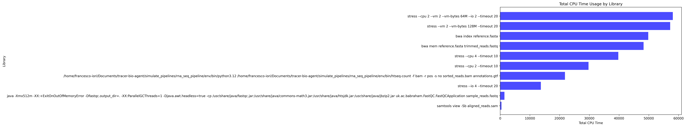
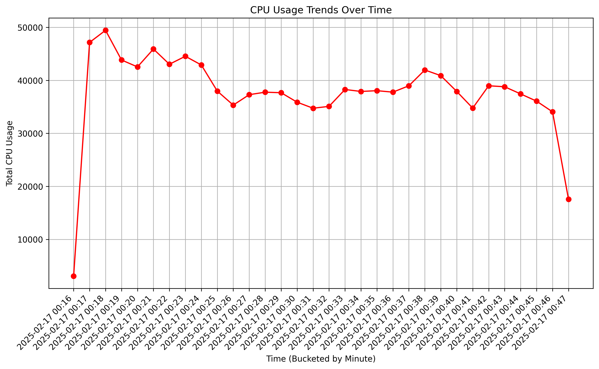
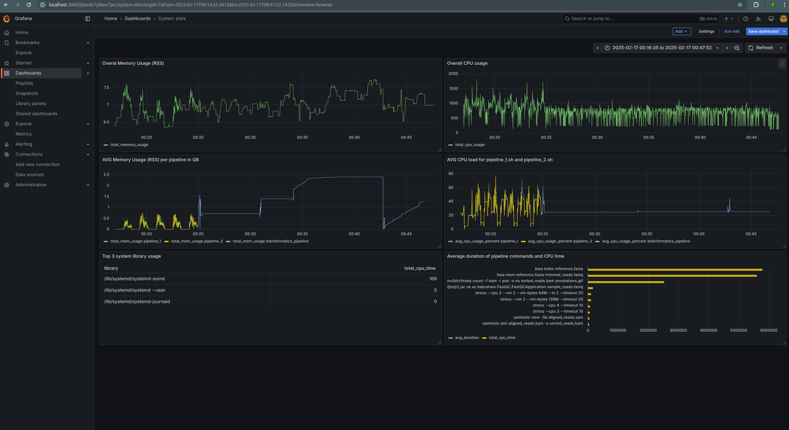
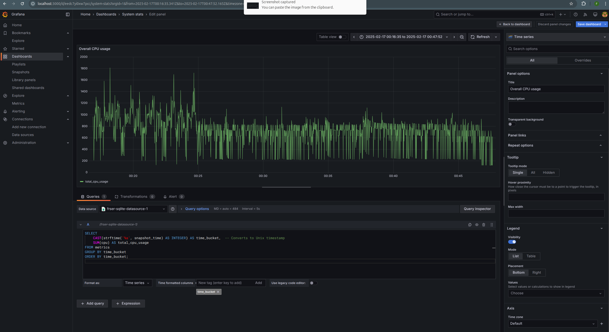
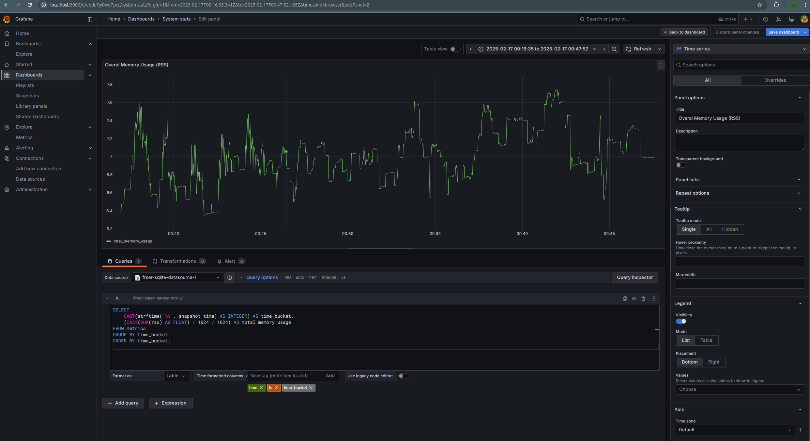
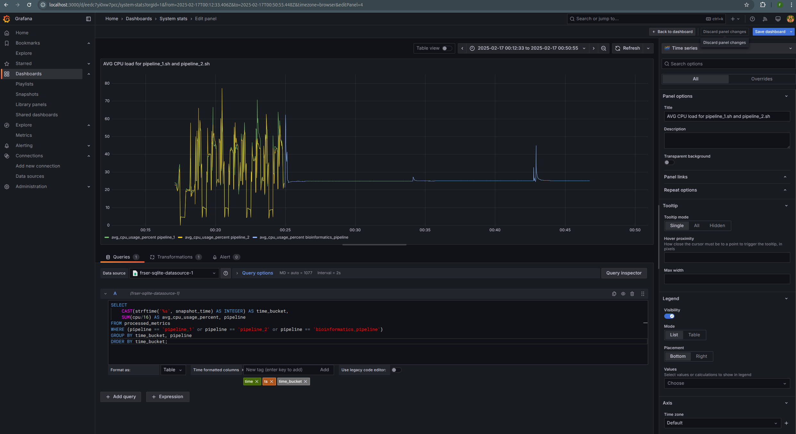
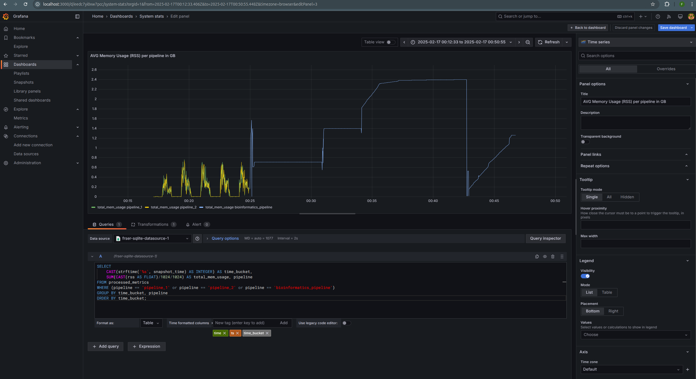
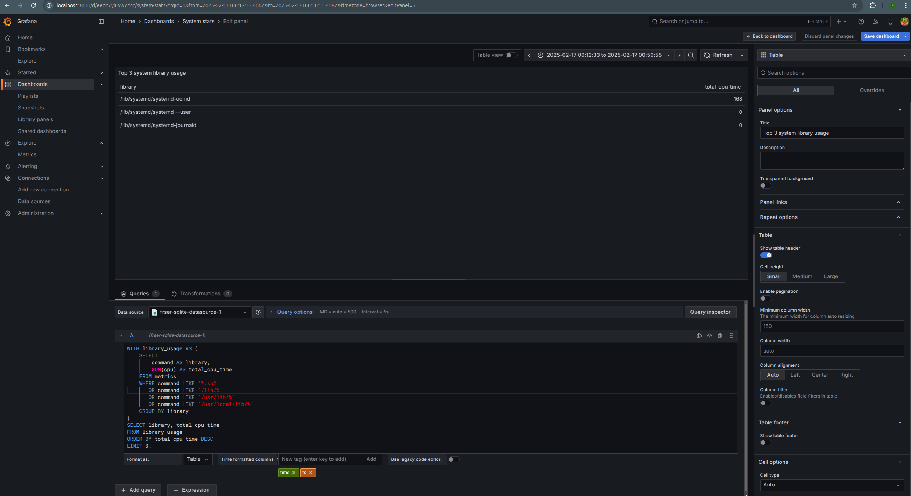
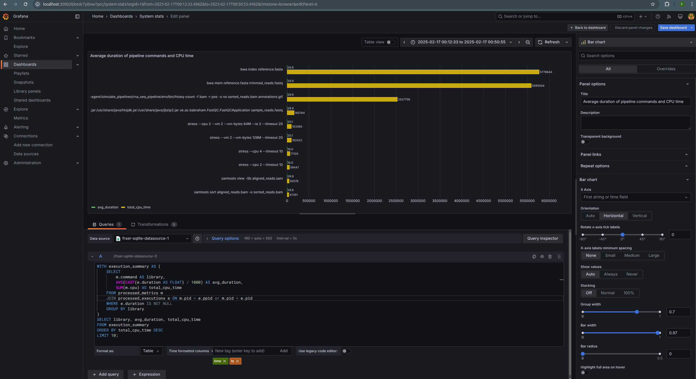

# Query Validation Scripts  

The `query_validation_scripts` directory contains scripts designed to validate execution data and analyze system performance. These scripts process SQLite data, convert it to Parquet format, and generate insights using DuckDB and visualization tools.

## Folder Structure  

```
query_validation_scripts/ 
├── execution_analysis.py # Script for analyzing execution data and generating plots 
├── sql_to_parquet.py # Converts SQLite tables to Parquet files 
├── top_n_libraries.py # Identifies the top 10 libraries with the highest CPU hours
```

## Scripts  

### 1. `sql_to_parquet.py`  
This script extracts data from an SQLite database and converts it into Parquet format, which is optimized for analytical workloads. The generated Parquet files are stored in the `parquet_files/` directory.

### 2. `top_n_libraries.py`  
This script identifies the 10 libraries with the highest CPU hours based on execution metrics. The results help determine which libraries are consuming the most computational resources.

#### Sample Output

```
Top 10 CPU-Consuming Libraries
Process                                               CPU Hours
-----------------------------------------------------------------
/lib/systemd/systemd-oomd                                  0.21
/usr/lib/snapd/snapd                                       0.00
/lib/systemd/systemd-udevd                                 0.00
/lib/systemd/systemd-logind                                0.00
/lib/systemd/systemd --user                                0.00
/lib/systemd/systemd-resolved                              0.00
/usr/lib/bluetooth/bluetoothd                              0.00
/lib/systemd/systemd-timesyncd                             0.00
/lib/systemd/systemd-journald                              0.00
/usr/lib/polkit-1/polkitd --no-debug                       0.00
-----------------------------------------------------------------
```

```
Top 10 CPU-Consuming Processes
Process                                               CPU Hours
-----------------------------------------------------------------
ps -eo user,pid,ppid,%cpu,%mem,vsz,rss,tty,stat,start,time,command       787.56
.venv/bin/python3.12 agent.py                             86.59
stress --cpu 2 --vm 2 --vm-bytes 64M --io 2 --timeout 20        80.69
stress --vm 2 --vm-bytes 128M --timeout 20                79.43
bwa index reference.fasta                                 69.19
bwa mem reference.fasta trimmed_reads.fastq               67.00
stress --cpu 4 --timeout 10                               55.19
/snap/pycharm-community/439/bin/pycharm                   52.45
stress --cpu 2 --timeout 10                               46.27
stress --io 4 --timeout 20                                19.02
-----------------------------------------------------------------
```

### 3. `execution_analysis.py`  
The `execution_analysis.py` script performs two key analyses using DuckDB and Matplotlib:

- **Execution Time vs CPU Usage for Libraries**: This analysis ranks libraries by total CPU time usage and visualizes the results in a horizontal bar chart.
- **CPU Usage Trends Over Time**: This analysis tracks total CPU usage over time, grouping data into time buckets.

## Generated Plots  

### Execution Time vs CPU Usage for Libraries  
This chart visualizes the top 10 libraries based on CPU time consumption.



### CPU Usage Trends Over Time  
This line plot shows the total CPU usage over time, helping to identify workload patterns.



## How It Works  

The `execution_analysis.py` script connects to DuckDB and loads Parquet files. It executes two key queries:

1. **Execution Time Analysis for Libraries**  
   - Joins execution and metrics data to compute the average execution time and total CPU time for each library.
   - Returns the top 10 libraries sorted by total CPU time.

2. **CPU Usage Trends Over Time**  
   - Groups CPU usage data into time buckets (per minute).
   - Aggregates total CPU usage for each time bucket to analyze trends.

Both analyses generate plots that are saved as `execution_time_vs_cpu_usage.png` and `cpu_usage_trends.png`.

## Grafana Observability Platform
A local Grafana instance has been used to create a small dashboard to visualise and analyse the data.



### Overall CPU Usage

Query:
```sqlite
SELECT 
    CAST(strftime('%s', snapshot_time) AS INTEGER) AS time_bucket,
    (CAST(SUM(rss) AS FLOAT) / 1024 / 1024) AS total_memory_usage
FROM metrics
GROUP BY time_bucket
ORDER BY time_bucket;
```
This SQL query retrieves memory usage data from a table named metrics and aggregates it over time.

### Overall Memory RSS Usage

Query:
```sqlite
SELECT 
    CAST(strftime('%s', snapshot_time) AS INTEGER) AS time_bucket,
    (CAST(SUM(rss) AS FLOAT) / 1024 / 1024) AS total_memory_usage
FROM metrics
GROUP BY time_bucket
ORDER BY time_bucket;
```
This SQL query is used to aggregate memory usage over time from a metrics table. 
It converts timestamps into Unix time, sums memory usage, and orders results chronologically.
The data is shown in GBs.

### Pipeline CPU Usage

Query:
```sqlite
SELECT 
    CAST(strftime('%s', snapshot_time) AS INTEGER) AS time_bucket,
    SUM(cpu/16) AS avg_cpu_usage_percent, pipeline
FROM processed_metrics
WHERE (pipeline == 'pipeline_1' or pipeline == 'pipeline_2' or pipeline == 'bioinformatics_pipeline')
GROUP BY time_bucket, pipeline
ORDER BY time_bucket;
describe this
```
This SQL query retrieves and aggregates CPU usage data for the three simulated pipelines 
(pipeline_1, pipeline_2, and bioinformatics_pipeline) over time from the processed_metrics table.

### Pipeline Memory Usage

Query:
```sqlite
SELECT 
    CAST(strftime('%s', snapshot_time) AS INTEGER) AS time_bucket,
    SUM(CAST(rss AS FLOAT)/1024/1024) AS total_mem_usage, pipeline
FROM processed_metrics
WHERE (pipeline == 'pipeline_1' or pipeline == 'pipeline_2' or pipeline == 'bioinformatics_pipeline')
GROUP BY time_bucket, pipeline
ORDER BY time_bucket;
```
This SQL query retrieves and aggregates memory usage data for specific pipelines 
from the processed_metrics table. 
It groups the results by time and pipeline while converting memory usage to gigabytes.

### Top 3 System Libraries

Query:
```sqlite
WITH library_usage AS (
    SELECT 
        command AS library,
        SUM(cpu) AS total_cpu_time
    FROM metrics
    WHERE command LIKE '%.so%' 
       OR command LIKE '/lib/%' 
       OR command LIKE '/usr/lib/%' 
       OR command LIKE '/usr/local/lib/%'  
    GROUP BY library
)
```
This SQL query identifies the top 3 system libraries that have consumed the most CPU time. 
It does so by filtering and aggregating CPU usage data from the metrics table.

### Average Pipeline Commands Duration

Query:
```sqlite
WITH execution_summary AS (
    SELECT 
        m.command AS library,
        AVG(CAST(e.duration AS FLOAT) / 1000) AS avg_duration,
        SUM(m.cpu) AS total_cpu_time
    FROM processed_metrics m
    JOIN processed_executions e ON m.pid = e.ppid or m.pid = e.pid
    WHERE e.duration IS NOT NULL
    GROUP BY library
)
SELECT library, avg_duration, total_cpu_time
FROM execution_summary
ORDER BY total_cpu_time DESC
LIMIT 10;
```
This SQL query analyzes library execution performance by computing the average execution 
time and total CPU consumption for shared libraries. 
It retrieves the top 10 libraries that have used the most CPU time.